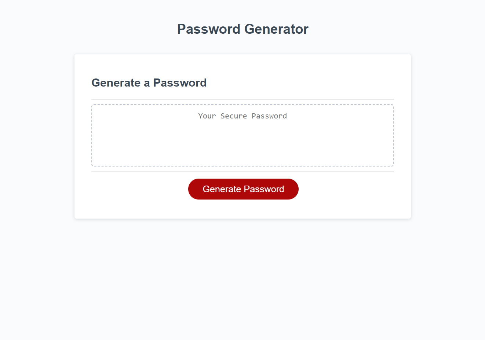

# random-password-generator

## Description

A generator where you can pick between uppercase letters, lowercase letters, numeric and special characters to randomly give you a password that can be used for any sign-ups or logins and take out the hassle of brainstorming one on the spot.

## Usage

- By clicking on the "Generate Password" button, you will be prompted to pick between 8 and 128 characters.

    

- After that, you get to pick between uppercase and lowercase letters, numbers and special characters that you would like your password to have.

- PLEASE NOTE: You'll have to pick at least one of the options or you will be required to repeat the process.
    

## Credits

<a href="https://www.youtube.com/watch?v=PkZNo7MFNFg&t=386s">FreeCodeCamp's Javascript Tutorial</a> for helping to understand concepts.

## License

MIT License

Copyright (c) 2023 Ida Reis

Permission is hereby granted, free of charge, to any person obtaining a copy
of this software and associated documentation files (the "Software"), to deal
in the Software without restriction, including without limitation the rights
to use, copy, modify, merge, publish, distribute, sublicense, and/or sell
copies of the Software, and to permit persons to whom the Software is
furnished to do so, subject to the following conditions:

The above copyright notice and this permission notice shall be included in all
copies or substantial portions of the Software.

THE SOFTWARE IS PROVIDED "AS IS", WITHOUT WARRANTY OF ANY KIND, EXPRESS OR
IMPLIED, INCLUDING BUT NOT LIMITED TO THE WARRANTIES OF MERCHANTABILITY,
FITNESS FOR A PARTICULAR PURPOSE AND NONINFRINGEMENT. IN NO EVENT SHALL THE
AUTHORS OR COPYRIGHT HOLDERS BE LIABLE FOR ANY CLAIM, DAMAGES OR OTHER
LIABILITY, WHETHER IN AN ACTION OF CONTRACT, TORT OR OTHERWISE, ARISING FROM,
OUT OF OR IN CONNECTION WITH THE SOFTWARE OR THE USE OR OTHER DEALINGS IN THE
SOFTWARE.
